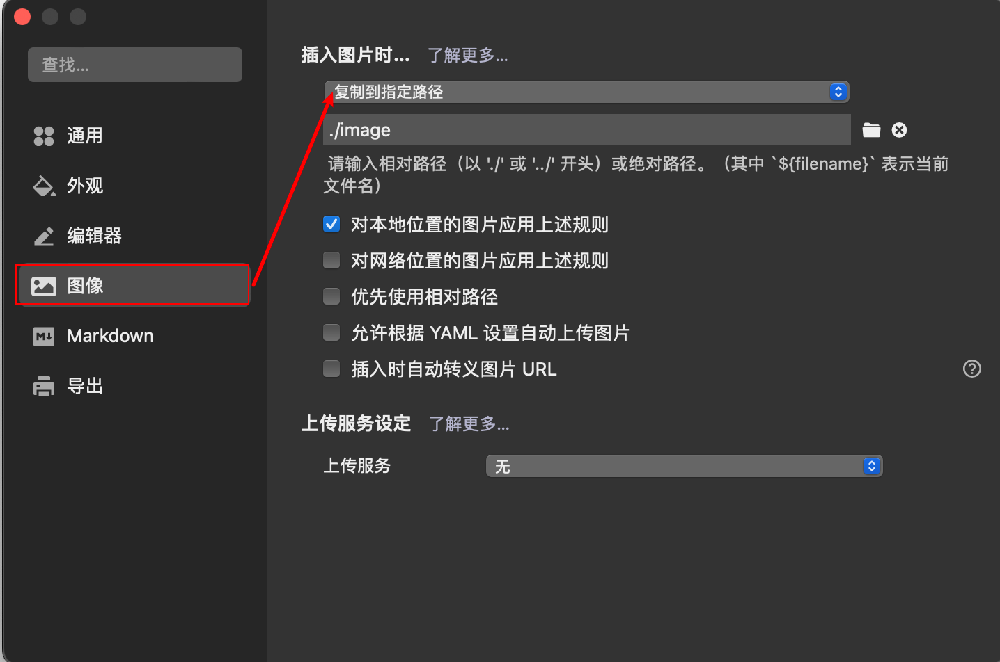
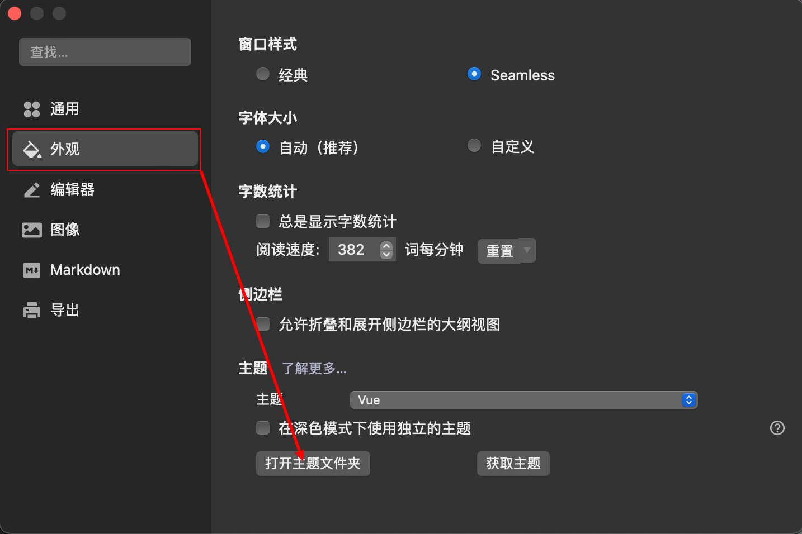

# Typora下载与安装

下载地址：https://www.typoraio.cn/

# Typora基本设置

## 图片设置



## 外观设置

1、Typora官网主题地址：https://theme.typoraio.cn/

2、将下载的主题资源复制到下图打开文件：



# Typora基本使用

## 官方使用文档说明

地址：https://support.typoraio.cn/zh/Markdown-Reference/

## 插入标题

快捷键：windows: ctrl + (1~6); Mac: cmd + (1~6)

语法：一级标题：# 

​			  二级标题： ## 

​			  三级标题： ### 

​			  四级标题： ####  

​			  五级标题：#####  

​			  六级标题：######

## 插入表格

快捷键：windows: ctrl + T; Mac: cmd + option + T

## 插入代码块

快捷键：windows: ctrl + shift + K; Mac: cmd + option + C

语法：```+ (代码语言[java, html...])

## 插入公式块

快捷键：windows: ctrl + shift + B; Mac: cmd + option + B

## 插入列表

### 有序列表

快捷键：windows: ctrl + shift + [; Mac: cmd + option + O

语法：输入 `* list item 1` 将创建一个无序列表，该 `*` 符号可以替换为 `+` 或 `-`.

### 无序列表

快捷键：windows: ctrl + shift + ]; Mac: cmd + option + U

语法：输入 `1. list item 1` 将创建一个有序列表，其 markdown 源代码如下：

### 任务列表

快捷键：Mac: cmd + option  + X

### 列表缩进

#### 增加缩进

快捷键：cmd + ]

#### 减少缩进

快捷键：cmd +[

### **退出 序号 状态**

”按两次回车键“，或按 cmd + [

## **插入超链接**

快捷键：Mac: cmd + k

## 链接引用

快捷键：windows: ctrl + shift + L; Mac: cmd + option + L

## 脚注

快捷键：windows: ctrl + shift + R; Mac: cmd + option + R

## 段落

快捷键：ctrl+ O

## 加粗

快捷键：windows: ctrl + B; Mac: cmd + B

## 倾斜

快捷键：windows: ctrl + I; Mac: cmd + I

## 强调

快捷键： ctrl + ` 

语法：`文本`

## 下划线

快捷键：windows: ctrl + U; Mac: cmd + U

## 注释

快捷键：ctrl + -

## 删除线

快捷键：ctrl + ~

## 引用

快捷键：windows: ctrl + shift + Q; Mac: cmd + option + Q

语法：> 


